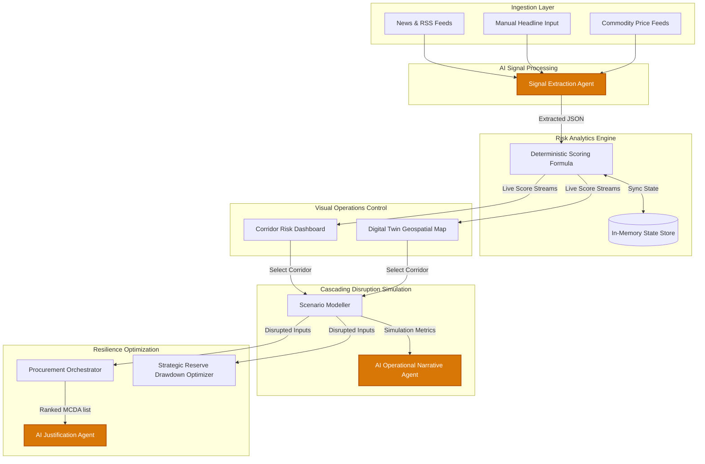

# ET·AI — AI-Driven Energy Supply Chain Resilience Platform

ET·AI is an interactive decision-support system and simulation terminal built for **ET AI Hackathon 2026 — Round 2** (Problem Statement 2: *"AI-Driven Energy Supply Chain Resilience for Import-Dependent Economies"*).

---

## 📖 Project Context & Problem Statement

India is highly import-dependent, sourcing **~88% of its crude oil imports** from global suppliers. A massive portion of this supply (**40–45%**) transits through the highly volatile **Strait of Hormuz** chokepoint. To mitigate supply disruptions, India maintains Strategic Petroleum Reserves (SPR) providing approximately **9.5 days of national consumption cover**.

Geopolitical disruptions (such as the 2025 US-Iran standoff, Red Sea/Houthi attacks, and sanctions pressure) demonstrate that traditional supply chain systems cannot:
1. Model complex geopolitical scenario impacts in real-time.
2. Produce fast, mathematically sound, and operationally executable rerouting recommendations.

According to McKinsey, economies lacking integrated response intelligence take an average of **47 days longer** to stabilize oil supply after shocks. **ET·AI solves this by reducing response time from weeks to seconds.**

---

## 🏗️ System Architecture & Data Flow

The platform separates ingestion, geopolitical signal classification, numerical simulation, and procurement optimization into clean logical modules:



### Core Data Flow Description:
1. **Ingestion & Classification**: Natural language headlines from news feeds (or manual inputs) hit the API, prompting the **Signal Ingestion Agent** (swappable LLM) to classify the corridor, event category, severity (1-5), and confidence.
2. **Deterministic Risk Scoring**: The scoring engine updates risk scores in real-time, decaying older events by 5 points/day. 
3. **Cascading Economic Modeller**: Simulates refinery run-rate drops, fuel price fluctuations, power sector stress, and GDP impact using deterministic mathematical formulas. An on-demand LLM creates an operational assessment narrative based on the results.
4. **Resilience Optimization**: Computes a Strategic Petroleum Reserve (SPR) drawdown schedule (Linear or Front-loaded) and evaluates alternative suppliers using a Multi-Criteria Decision Analysis (MCDA) model (mapping price, compatibility, tanker availability, and port congestion).

### Data Flow Diagram (ASCII Fallback)
```
[News/RSS feeds] ────────────────┐
[Manual headline input (demo)] ──┼─► Signal Ingest Agent (LLM) ─► Risk Scoring Engine (deterministic)
[Commodity price feed (mocked)] ─┘                                      │
                                                                        ▼
                                                          Corridor Risk Dashboard (live)
                                                                        │
                                                                        ▼
                                                  Scenario Modeller (parameterized math)
                                                              │                       │
                                                    LLM narrative summary             ▼
                                                              │              Cascading impact charts
                                                              ▼
                                              Procurement Orchestrator (MCDA supplier ranking)
                                                              │
                                                              ▼
                                              Strategic Reserve Optimizer (drawdown curve)
                                                              │
                                                              ▼
                                              Digital Twin Map View (geospatial simple-maps)
```

---

## 🌟 Core Page Modules

1. **Risk Intel Dashboard (Module 1)**: Renders a dense status grid of the 6 transit corridors with color-coded risk levels. Paste fresh headlines to see scores update and cards animate in real-time.
2. **Scenario Modeller (Module 2)**: Adjust sliders for capacity loss and duration. View instant economic projections and request an AI narrative summary.
3. **Procurement Orchestrator (Module 3)**: Renders alternative crude supplies (WTI, Murban, Arab Light, Urals, Liza, etc.) ranked by cost, transit time, and port metrics. Features AI-generated justification sentences.
4. **Reserve Optimizer (Module 4)**: Built directly into the Scenarios view. Plots the remaining SPR buffer over time and triggers warnings when parameters exceed the 9.5-day cover threshold.
5. **Digital Twin Map (Module 5)**: Renders a map centering on India and the Middle East, highlighting transit corridors and domestic refinery locations. Click any corridor to model its disruption.

---

## 🛠️ Setup & Installation

ET·AI runs locally using a Python FastAPI backend and a React (Vite) frontend.

### Prerequisites
- Python 3.10+
- Node.js 18+

### 1. Backend Setup
1. Navigate to the `backend` directory:
   ```bash
   cd backend
   ```
2. Create and configure your `.env` file:
   ```bash
   cp .env.example .env
   ```
   Open `.env` and insert your API credentials (default is **Groq**):
   ```env
   DEFAULT_GROQ_API_KEY=your_groq_api_key_here
   ```
3. Install dependencies:
   ```bash
   pip install -r requirements.txt
   ```
4. Run the backend server:
   ```bash
   python -m uvicorn main:app --reload --port 8000
   ```
   Verify health status at: `http://localhost:8000/api/health`

### 2. Frontend Setup
1. Navigate to the `frontend` directory:
   ```bash
   cd ../frontend
   ```
2. Install npm packages:
   ```bash
   npm install --legacy-peer-deps
   ```
3. Launch the development server:
   ```bash
   npm run dev
   ```
4. Access the platform at: `http://localhost:5173/`

---

## 📂 Phase Build Logs
Progress is cataloged inside the `docs/` folder, detailing implementation history step-by-step:
- [Phase 0 — Foundations](file:///e:/VISHAL%20PRAJAPATI/TECH/Projects/ET-AI/docs/phase-0-foundations.md)
- [Phase 1 — Risk Intelligence Agent](file:///e:/VISHAL%20PRAJAPATI/TECH/Projects/ET-AI/docs/phase-1-risk-intelligence.md)
- [Phase 2 — Disruption Scenario Modeller](file:///e:/VISHAL%20PRAJAPATI/TECH/Projects/ET-AI/docs/phase-2-scenario-modeller.md)
- [Phase 3 — Integration Checkpoint](file:///e:/VISHAL%20PRAJAPATI/TECH/Projects/ET-AI/docs/phase-3-integration-checkpoint.md)
- [Phase 4 — Procurement Orchestrator](file:///e:/VISHAL%20PRAJAPATI/TECH/Projects/ET-AI/docs/phase-4-procurement-orchestrator.md)
- [Phase 5 — Reserve Optimizer](file:///e:/VISHAL%20PRAJAPATI/TECH/Projects/ET-AI/docs/phase-5-reserve-optimizer.md)
- [Phase 6 — Digital Twin Map](file:///e:/VISHAL%20PRAJAPATI/TECH/Projects/ET-AI/docs/phase-6-digital-twin.md)
- [Phase 7 — Polish Pass](file:///e:/VISHAL%20PRAJAPATI/TECH/Projects/ET-AI/docs/phase-7-polish.md)
